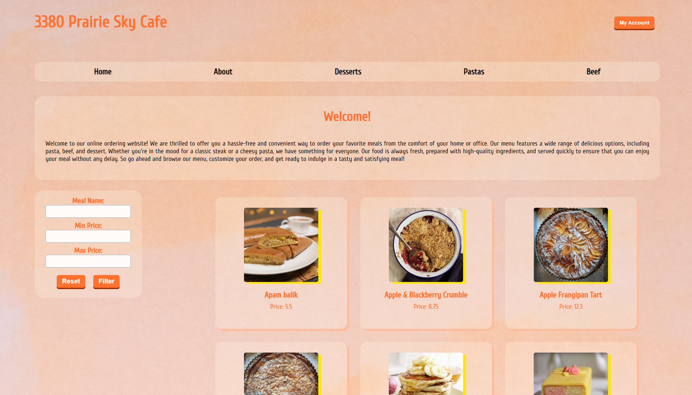
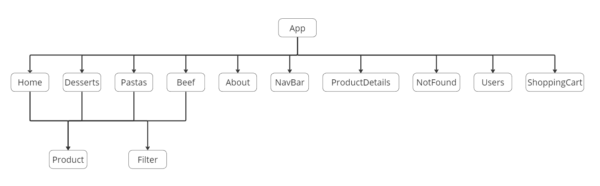

# CSIS3380 Final Project

This project entails a <b>MERN application</b> designed specifically for <b>3380 Prairie Sky Cafe</b>, where users are able to register an account and place orders. The system is also capable of keeping track of the user's previous orders.

# Features
- Combining data from TheMealDB API and self-creacted API to render **React card components** for meal items
- **Fading-in css effect** on card rendering and **floating css effect** on card hovered
- Leverage on React state to create a **filter for user to search for desired items** based on names or prices
- **Create user account** and **login user account** functions
- Allow user to **add items to shopping cart** with specified quantities
- Allow user to **remove items from shopping cart**
- Use **MongoDB to record user's shopping cart items** so they can be reyrieved even after the user logged out

# Tech Stack

**Frontend**: HTML, CSS, JavaScript, React.js <br>
**Backend**: Express.js, Node.js <br>
**Database**: MongoDB

# APIs

- **TheMealDB API** <br>
  https://www.themealdb.com/api.php
- **Self-reacted API in JSON format**<br>
  <i>sample item structure:</i>
  ```
  {
      "descriptiveName": "Apam Balk = Malasian Sweet Peanut Pancake",
      "price": 5.50,
      "description": "Apam balik, a Malaysian pancake filled with sugar, peanuts, and cream corn."
  }
  ```

# Structural Map for Components


# Getting Started

**1. Clone the repository:** 

```
git clone https://github.com/BenTsui2023/csis3380-final-project.git
```
**2. Go to the directory:**

```
cd .\csis3380-final-project\
```

**3. Install dependencies:**

```
npm i
```

**4. Ready to run:**

```
npm start
```
